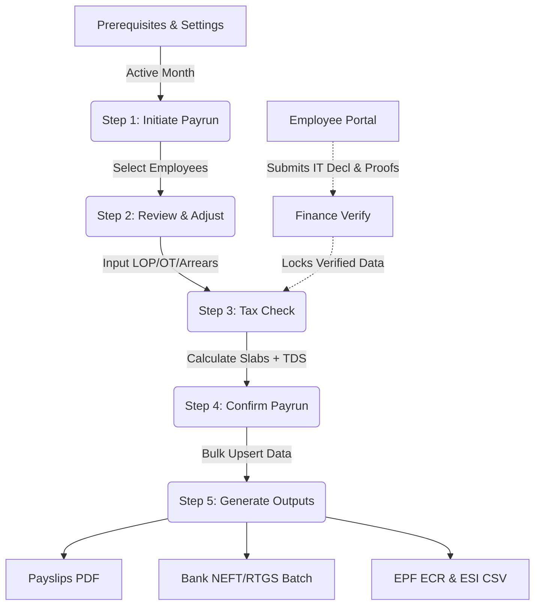

# End-to-End Payroll Process Flow
**Project Name:** Indian Payroll Management System

This document provides a holistic blueprint of how a monthly payrun spans from Prerequisites through to final banking outputs for both business and technical audiences.

---

## Process Map (Mermaid Diagram)

---

## Phase 1: Prerequisites
Before initiating a payrun, the system strictly expects the following dependencies to be resolved.
- **Company Matrix Settings Check:** Ensure PT and LWF toggles are accurately declared for the active states inside the matrix.
- **Finance Pipeline Lock:** All `submitted` IT Declarations and Reimbursement Claims should ideally be `verified` or `rejected` in the **Finance Verification Dashboard**. The Payroll Engine relies *exclusively* on the verified payload for reducing taxable liability.

---

## Phase 2: Execution (The 5 Steps)

### Step 1: Initiate
- **Start:** HR Admin accesses the `Payroll Operations` module and creates a new payload for a target month and year (e.g., April 2026).
- **Inputs:** Month, Year, and structural filters (e.g., specific departments only).
- **Action:** Select the roster of applicable employees using checkboxes. Discard inactive profiles.
- **Backend Metric:** Extrapolates the raw Total Monthly CTC required before any constraints are evaluated.

### Step 2: Review & Adjust
- **Start:** The UI generates a manipulable grid table pre-populated with mathematical defaults for the selected roster.
- **Inputs Required:**
  - `LOP Days`: Defaults to 0. HR inputs the exact number of unpaid leaves taken.
  - `Overtime (OT)`: Optional dynamic cash bonus logic.
  - `Arrears`: Used if an employee's salary increments retroactively.
- **Processing:** As LOP is inputted, the mathematical attendance factor recalculates the `Basic` component. Any linked formula components (like HRA `= Basic * 0.40`) scale downwards dynamically.

### Step 3: Tax Check & TDS Validation
- **Start:** The engine receives the prorated gross values from Step 2 and performs real-time execution of `payrollEngine.js`.
- **Logic Sequence:**
  1. Determine `tax_regime` (Old/New) from the employee's payload.
  2. Parse the locked variables from Finance (`verified_data` API payload).
  3. Deduct Chapter VI-A & Sec 24 natively on projected annual equivalents.
  4. Yield the ultimate TDS bucket and deduce the localized EPF/PT margins.
- **Identify Edge Cases:**
  - *Negative Net Pay warning:* If LOP is 30 days but statutory components like flat-PT enforce a value, net pay equates to `<0`. The engine explicitly truncates Net Pay to `0` and highlights it in red.
  - *Missing Declarations:* Highlights employees on the Old Regime who forgot to declare metrics.

### Step 4: Confirm (Hard Lock)
- **Action:** A confirmation modal asks the Administrator to visually confirm the absolute sum of Net Payable and Total TDS mapped.
- **Backend Query:** Translates the computed matrix state tree into an immutable relational JSON structure. Fires a `bulkUpsert` query against Supabase, targeting `payroll_records`.
- **Status Change:** The active payrun state moves from `tax_checked` to `confirmed`. All dynamic overrides are now blocked.

### Step 5: Post-Payrun Generation
- **Start:** Triggered dynamically from the Confirm stage.
- **Final Operations:**
  1. **Payslips:** Constructs localized visual components (`PayrollOps_SlipViewer.jsx`) injecting the locked payload, mapping it printable formats.
  2. **Bank File Batch:** Formats standard NEFT structures to pass onto corporate banking portals.
  3. **Government Returns:** Translates EPF metadata into `.txt` hash-seperated format compliant with EPFO portal (`EPF_ECR`). Translates ESI outputs into `,` delimited `.csv`.

---

## Phase 3: Conclusion & Closure
After generating the outputs, the payrun status evolves to `completed`. Employees natively retrieve their payslips through their self-service gateway, automatically rendered without requiring manual PDFs via email. 
