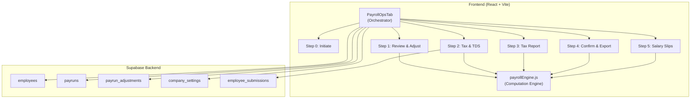
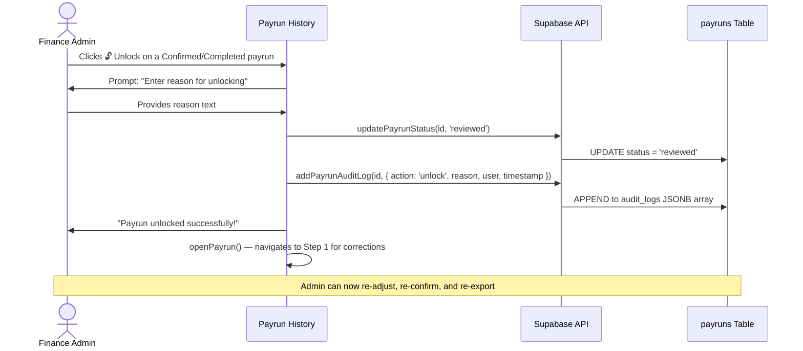

# Payroll Operations Module — Functional Requirement Document (FRD)

**Version:** 2.0  
**Date:** April 24, 2026  
**Module:** Payroll Operations (`PayrollOpsTab`)  
**Application:** Payroll Traceability Matrix  
**Backend:** Supabase (PostgreSQL + RLS)  
**Frontend:** React (Vite)  

---

## 1. Executive Summary

The Payroll Operations Module is the core transactional engine within the Payroll Traceability Matrix application. It orchestrates the end-to-end monthly salary computation and disbursement lifecycle for Indian payroll, encompassing:

- Employee roster selection and payrun initiation
- Per-employee salary review with attendance, overtime, arrears, and variable pay adjustments
- Income tax (TDS) computation under both Old and New regimes (FY 2025-26 Budget slabs)
- Statutory deduction calculations (EPF, ESIC, Professional Tax, Labour Welfare Fund) with state-specific logic
- Compliance file exports (Bank transfer files, EPF ECR, ESIC returns, TDS 24Q, PT/LWF state-wise ZIPs)
- Salary slip generation, publishing, and bulk operations
- Post-finalization correction (unlock) workflows with audit logging
- Salary status management (Active, Withheld, Absconding, FnF Pending)

> [!IMPORTANT]
> All calculations are performed client-side by a deterministic computation engine (`payrollEngine.js`). The backend (Supabase) stores configuration, employee records, payrun metadata, and per-employee adjustments. There is no server-side computation layer — the engine is pure JavaScript.

---

## 2. System Architecture Overview

---

## 3. Database Schema

### 3.1 `employees` Table

| Column | Type | Description |
|--------|------|-------------|
| `id` | UUID (PK) | Auto-generated unique identifier |
| `emp_code` | TEXT | Human-readable employee code (e.g., `EMP001`) |
| `name` | TEXT | Full name |
| `department` | TEXT | Department name |
| `designation` | TEXT | Job title |
| `date_of_joining` | DATE | Employment start date |
| `is_active` | BOOLEAN | Login/portal access flag |
| `salary_structure` | JSONB | Array of salary component objects |
| `input_mode` | TEXT | `monthly` or `annual` — how amounts in `salary_structure` are entered |
| `tax_regime` | TEXT | `new` or `old` |
| `bank_info` | JSONB | `{ bank_name, account_no, ifsc }` |
| `work_state` | TEXT | State code for PT/LWF calculation |
| `work_city` | TEXT | City name for HRA metro classification |
| `base_state` | TEXT | Residential state for HRA |
| `base_city` | TEXT | Residential city |
| `exit_date` | DATE | Nullable — triggers exit/FnF projection |
| `exit_reason` | TEXT | `Resignation`, `Termination`, `Retirement` |
| `salary_status` | TEXT | `active`, `withheld`, `absconding`, `fnf_pending` |

### 3.2 `payruns` Table

| Column | Type | Description |
|--------|------|-------------|
| `id` | UUID (PK) | Auto-generated |
| `month_year` | TEXT | e.g., `"April 2026"` |
| `status` | TEXT | `draft` → `initiated` → `reviewed` → `tax_checked` → `confirmed` → `completed` |
| `audit_logs` | JSONB | Array of `{ action, reason, user, timestamp }` objects for correction history |
| `created_at` | TIMESTAMPTZ | Creation timestamp |
| `updated_at` | TIMESTAMPTZ | Last modification |

### 3.3 `payrun_adjustments` Table

| Column | Type | Description |
|--------|------|-------------|
| `payrun_id` | UUID (FK → payruns) | Payrun reference |
| `employee_id` | UUID (FK → employees) | Employee reference |
| `adjustments` | JSONB | Per-employee overrides: LOP days, OT, arrears, variable payouts, manual deductions, tax overrides |
| `computed_data` | JSONB | Snapshot of computed output (used for YTD aggregation in future payruns) |
| Unique constraint on | `(payrun_id, employee_id)` | UPSERT-safe |

### 3.4 `company_settings` Table

| Column | Type | Description |
|--------|------|-------------|
| `id` | UUID (PK) | Singleton row |
| `settings` | JSONB | Full company configuration (EPF method, PT registrations, display preferences, etc.) |

### 3.5 `employee_submissions` Table

| Column | Type | Description |
|--------|------|-------------|
| `employee_id` | UUID (FK) | Submitting employee |
| `financial_year` | TEXT | e.g., `"2026-27"` |
| `type` | TEXT | `it_declaration` or `reimbursement` |
| `status` | TEXT | `draft` → `submitted` → `verified` / `rejected` |
| `submitted_data` | JSONB | Employee's declared values and proof URLs |
| `verified_data` | JSONB | Finance-approved values that feed into payrun computation |

---

## 4. Payroll Pipeline — Step-by-Step Lifecycle

The payroll pipeline consists of **6 sequential steps**, each represented by a dedicated UI component and a set of functional requirements.

### Lifecycle Flowchart

```mermaid
flowchart TB
    START(["🚀 Finance Admin<br/>opens Payroll Operations"]) --> LOAD["Load employees, payruns,<br/>company settings from Supabase"]
    LOAD --> STEP0

    subgraph STEP0["Step 0 — Initiate"]
        direction TB
        A1["Select Month & Year"]
        A2["Filter employees by Department"]
        A3["Auto-exclude Withheld<br/>& Absconding employees"]
        A4["Review salary status badges<br/>(WITHHELD / ABSCONDING / FNF)"]
        A5["Select employees for payrun"]
        A6{"Duplicate draft<br/>exists?"}
        A7["Resume existing draft"]
        A8["Create new payrun record<br/>in Supabase"]
        A1 --> A2 --> A3 --> A4 --> A5 --> A6
        A6 -- Yes --> A7
        A6 -- No --> A8
    end

    STEP0 --> STEP1

    subgraph STEP1["Step 1 — Review & Adjust"]
        direction TB
        B1["For each employee, open<br/>Adjustment Detail Pane"]
        B2["Set: Days in Month, LOP Days,<br/>OT Hours, OT Rate,<br/>Leave Encashment Days,<br/>Manual Deduction (₹)"]
        B3["Review Salary Component Table<br/>(Monthly → Prorated → Final)"]
        B4["Set Variable Payouts<br/>per component"]
        B5["Add Arrear Entries<br/>(month, historical gross, days)"]
        B6["Engine computes live:<br/>Fixed Gross, Variable, Total Gross, Net Pay"]
        B7["Arrear breakup & Variable breakup<br/>(if configured as 'breakup' mode)"]
        B1 --> B2 --> B3 --> B4 --> B5 --> B6 --> B7
    end

    STEP1 --> STEP2

    subgraph STEP2["Step 2 — Tax & TDS"]
        direction TB
        C1["Auto-load verified IT Declarations<br/>from employee_submissions"]
        C2["Auto-fetch YTD TDS history<br/>from prior payruns in FY"]
        C3["For each employee, configure:<br/>Tax Regime, 80C, 80D, NPS,<br/>Home Loan, Rent, LTA"]
        C4["Engine evaluates annual tax<br/>under selected regime"]
        C5["Monthly TDS = Remaining Tax ÷<br/>Months Remaining in FY"]
        C6["Exit employees: auto-cap TDS<br/>if it exceeds Net Pay Before TDS"]
        C1 --> C2 --> C3 --> C4 --> C5 --> C6
    end

    STEP2 --> STEP3

    subgraph STEP3["Step 3 — Tax Report"]
        direction TB
        D1["Per-employee Tax Computation Sheet"]
        D2["Section 1: Earnings Breakdown<br/>(YTD + Current + Projected + Total)"]
        D3["Section 2: Deductions & Exemptions<br/>(Standard Deduction, HRA, Chapter VI-A)"]
        D4["Section 3: Tax Liability Output<br/>(Formula Trace, Annual Tax, Monthly TDS)"]
        D5["Engine validation warnings<br/>(exit auto-cap, FnF flag)"]
        D1 --> D2 --> D3 --> D4 --> D5
    end

    STEP3 --> STEP4

    subgraph STEP4["Step 4 — Confirm & Export"]
        direction TB
        E1["Payrun Summary Dashboard<br/>(Total Gross, Net, EPF, ESIC, PT, LWF, TDS)"]
        E2["Payroll Register Preview Table"]
        E3["Generate Compliance Exports:<br/>Bank CSV, EPF ECR, ESIC Return,<br/>TDS 24Q, PT (state ZIP),<br/>LWF (state ZIP), Full Register"]
        E4["Confirm Payrun →<br/>Persist all adjustments & computed data<br/>to payrun_adjustments"]
        E5["Status transitions<br/>to 'confirmed'"]
        E1 --> E2 --> E3 --> E4 --> E5
    end

    STEP4 --> STEP5

    subgraph STEP5["Step 5 — Salary Slips"]
        direction TB
        F1["Salary Slip Preview<br/>(per employee)"]
        F2["Employee list with<br/>Dept/State filters"]
        F3["Publish / Unpublish<br/>individual slips"]
        F4["Bulk Publish via<br/>department/state filter"]
        F5["Excel-based bulk targeting<br/>(upload EMP_CODE list)"]
        F6["Download All Slips<br/>as Excel workbook"]
        F7["Print / Save PDF<br/>of current slip"]
        F8["Complete Payroll →<br/>Status = 'completed'"]
        F1 --> F2 --> F3 --> F4 --> F5 --> F6 --> F7 --> F8
    end

    STEP5 --> DONE(["✅ Payrun Completed"])

    %% Correction Flow
    DONE -.-> UNLOCK["🔓 Unlock Payrun<br/>(from History view)"]
    UNLOCK --> AUDIT["Write audit_logs entry<br/>(reason, user, timestamp)"]
    AUDIT --> REVERT["Revert status to 'reviewed'"]
    REVERT --> STEP1
```

---

## 5. Functional Requirements by Step

### 5.1 Step 0 — Initiate Payrun

| ID | Requirement | Priority |
|----|-------------|----------|
| FR-0.1 | System SHALL load all employees, existing payruns, and company settings from Supabase on module mount | P0 |
| FR-0.2 | User SHALL select a payroll month (1–12) and year | P0 |
| FR-0.3 | Employee roster SHALL display with columns: Checkbox, Emp Code, Name, Designation, Department, Joining Date, Regime | P0 |
| FR-0.4 | Employees with `salary_status = 'withheld'` or `'absconding'` SHALL be auto-excluded from default selection and "Select All" | P0 |
| FR-0.5 | Salary status badges (`WITHHELD`, `ABSCONDING`, `FNF`) SHALL be visually displayed alongside the tax regime badge | P1 |
| FR-0.6 | Department filter dropdown SHALL allow filtering the roster before selection | P1 |
| FR-0.7 | If a draft payrun for the selected month exists, system SHALL prompt user to resume instead of creating a duplicate | P0 |
| FR-0.8 | Summary card SHALL show count of selected employees and estimated Gross | P1 |
| FR-0.9 | "Payrun History" tab SHALL list all historical payruns with status, creation date, and action buttons (Open, Delete, Unlock) | P0 |
| FR-0.10 | Delete button SHALL only be available for non-confirmed, non-completed payruns | P0 |
| FR-0.11 | Unlock button SHALL only appear for `confirmed` or `completed` payruns | P0 |

### 5.2 Step 1 — Review & Adjust

| ID | Requirement | Priority |
|----|-------------|----------|
| FR-1.1 | Master table SHALL display all selected employees with: Name, Code, Department, Gross, Net Pay, and status indicators | P0 |
| FR-1.2 | Clicking an employee row SHALL open the Adjustment Detail Pane (slide-over panel) | P0 |
| FR-1.3 | Adjustment inputs SHALL include: Days in Month, LOP Days, OT Hours, OT Rate, Leave Encashment Days, **Manual Deduction (₹)** | P0 |
| FR-1.4 | Salary Component Table SHALL display each component with: Name, Type Badge, Monthly Amount, Prorated Amount, Variable Payout input, and Final Amount | P0 |
| FR-1.5 | For `variable` type components, an editable "Variable Payout" input field SHALL be provided per component | P0 |
| FR-1.6 | Arrears section SHALL allow adding multiple arrear entries with: Historical Month selector, Days in Month, Historical Gross, Arrear Days | P0 |
| FR-1.7 | Arrear days SHALL be auto-clamped to `min(monthDays, paidDays)` with validation message | P0 |
| FR-1.8 | Live Computation Result panel SHALL display: Fixed Gross, Variable Pay, Total Gross, Net Pay | P0 |
| FR-1.9 | If `arrearDisplayMode = 'breakup'` and visibility includes `'review'`, component-wise arrear breakup SHALL be displayed | P1 |
| FR-1.10 | If `incentiveDisplayMode = 'breakup'`, individual variable component breakups SHALL be displayed | P1 |
| FR-1.11 | All adjustments SHALL be auto-persisted to Supabase (`payrun_adjustments` table) on change | P0 |

### 5.3 Step 2 — Tax & TDS Configuration

| ID | Requirement | Priority |
|----|-------------|----------|
| FR-2.1 | For each employee, expandable tax card SHALL display: YTD Tax Deducted, Projected Annual Tax, Monthly TDS | P0 |
| FR-2.2 | System SHALL auto-load verified IT declarations from `employee_submissions` table for the current FY | P0 |
| FR-2.3 | System SHALL auto-fetch YTD TDS history from prior confirmed/completed payruns in the same FY | P0 |
| FR-2.4 | Tax regime selector SHALL allow switching between New and Old for each employee | P0 |
| FR-2.5 | Chapter VI-A inputs SHALL be editable: 80C, 80D Self, 80D Parents (+ senior citizen checkbox), 80CCD(1B) NPS, Home Loan Interest, 80G/80E, 80TTA/80TTB | P0 |
| FR-2.6 | Chapter VI-A inputs SHALL be disabled when tax regime is `new` | P0 |
| FR-2.7 | Monthly rent and LTA claimed inputs SHALL be provided for HRA exemption calculation | P1 |
| FR-2.8 | YTD history inputs SHALL be pre-populated but remain editable: YTD Gross, Basic, HRA, TDS, and Months Remaining | P0 |
| FR-2.9 | City type (Metro/Non-Metro) SHALL be auto-derived from work city | P0 |

### 5.4 Step 3 — Tax Report

| ID | Requirement | Priority |
|----|-------------|----------|
| FR-3.1 | Master-detail layout: employee list on left, detailed tax computation sheet on right | P0 |
| FR-3.2 | **Section 1 — Earnings Breakdown:** 4-column table with YTD Actuals, Current Month, Projected Future, and Total for Basic, HRA, Special Allowances, and Gross | P0 |
| FR-3.3 | **Section 2 — Deductions & Exemptions:** Standard Deduction (₹75k new / ₹50k old), HRA Exemption (Sec 10(13A)), and Chapter VI-A declarations | P0 |
| FR-3.4 | **Section 3 — Tax Liability Output:** Formula trace string, Annual Tax, Monthly TDS, Months remaining | P0 |
| FR-3.5 | Engine validation warnings (exit auto-cap, FnF flag) SHALL be displayed prominently with ⚠️ icons | P0 |

### 5.5 Step 4 — Confirm & Export

| ID | Requirement | Priority |
|----|-------------|----------|
| FR-4.1 | Payrun Summary Dashboard SHALL show aggregated totals: Total Gross, Net Payable, EPF, ESIC, PT, LWF, TDS | P0 |
| FR-4.2 | Payroll Register Preview SHALL list all employees with per-employee breakdown of Gross, EPF EE, ESIC EE, PT, LWF, TDS, Total Deductions, Net Pay | P0 |
| FR-4.3 | **Bank Transfer File** export SHALL support formats: HDFC, ICICI, SBI, Axis, Generic CSV | P0 |
| FR-4.4 | **EPF ECR v2** export SHALL generate UAN-based text file | P0 |
| FR-4.5 | **ESIC Return** export SHALL generate IP Number-based contribution file | P0 |
| FR-4.6 | **TDS 24Q** pre-fill stub SHALL be exported as Excel | P0 |
| FR-4.7 | **Professional Tax** return SHALL be exported as state-wise ZIP (each state as a separate Excel within the archive) | P0 |
| FR-4.8 | **LWF Statement** SHALL be exported as state-wise ZIP | P0 |
| FR-4.9 | **Payroll Register** (full) SHALL be exported as Excel with all component columns | P0 |
| FR-4.10 | "Confirm Payrun" action SHALL: persist all adjustments + computed data to `payrun_adjustments`, update payrun status to `confirmed` | P0 |

### 5.6 Step 5 — Salary Slips

| ID | Requirement | Priority |
|----|-------------|----------|
| FR-5.1 | Salary Slip SHALL render with: Company header, employee details grid, attendance summary, earnings table, deductions table, and Net Pay banner | P0 |
| FR-5.2 | If `showYTDOnPayslip = true`, a YTD column SHALL appear in both earnings and deductions tables | P1 |
| FR-5.3 | If `incentiveDisplayMode = 'breakup'`, variable components SHALL be listed individually in the slip | P1 |
| FR-5.4 | If `arrearDisplayMode = 'breakup'` with `slip` visibility, arrear components SHALL be listed individually | P1 |
| FR-5.5 | Employer contributions (PF, ESIC) SHALL be shown in the Net Pay footer as informational, not deducted from take-home | P0 |
| FR-5.6 | Employee list panel SHALL support Department and Work State (Location) dropdown filters | P1 |
| FR-5.7 | "Publish Filtered" button SHALL publish slips for all employees matching current filters | P1 |
| FR-5.8 | **Excel Upload Targeting** SHALL accept an `.xlsx` file with an `EMP_CODE` column and publish matching employee slips | P1 |
| FR-5.9 | "Download All" SHALL export all salary slips as a multi-sheet Excel workbook (one sheet per employee) | P0 |
| FR-5.10 | "Print / Save PDF" SHALL print the currently viewed salary slip using native browser print dialog | P0 |
| FR-5.11 | "Complete Payroll" SHALL update payrun status to `completed` and reset the view to Step 0 | P0 |

---

## 6. Computation Engine — Functional Specification

The payroll engine (`computeEmployeePayroll`) is a pure function that accepts an employee object enriched with adjustments and returns a fully computed payroll result.

### 6.1 Engine Input/Output Contract

**Inputs:** Employee salary components, attendance (days, LOP), overtime, arrear entries, variable payouts, tax declarations, YTD history, exit lifecycle, salary status, and company settings.

**Outputs:** Monthly computed payroll including earnings breakdown, statutory deductions, tax liability, net pay, and validation warnings.

### 6.2 Engine Computation Flow

```mermaid
flowchart TD
    INPUT(["Employee Object<br/>(Components + Adjustments + Overrides)"]) --> STATUS_CHECK

    STATUS_CHECK{"salary_status<br/>= withheld / absconding?"}
    STATUS_CHECK -- Yes --> ZERO_OUT["Return zeroed output<br/>salaryWithheld = true<br/>withheldReason = '...'"]
    STATUS_CHECK -- No --> PASS1

    subgraph RESOLUTION["3-Pass Component Resolution"]
        PASS1["PASS 1: Resolve Numeric Amounts<br/>Annual → Monthly conversion<br/>if inputMode = 'annual'"]
        PASS2["PASS 2: Resolve Formula Strings<br/>e.g. 'basic * 0.40' → evaluated<br/>using Function constructor"]
        PASS3["PASS 3: Hydrate Statutory Blanks<br/>EPF, ESIC, PT, LWF auto-filled<br/>based on state + gross"]
        PASS1 --> PASS2 --> PASS3
    end

    PASS3 --> ACCUMULATE

    ACCUMULATE["Final Accumulation:<br/>standardBasic, standardHRA, standardSpecial,<br/>reimbursements, variable, deductions"]

    ACCUMULATE --> ATTEND

    ATTEND["Attendance Proration:<br/>factor = (daysInMonth - LOP) / daysInMonth<br/>basic, hra, special *= factor"]

    ATTEND --> ARREARS

    ARREARS["Arrears Calculation:<br/>For each entry: (historicalGross / monthDays) × arrearDays<br/>Auto-clamp arrearDays to min(monthDays, paidDays)<br/>Generate component-wise breakup"]

    ARREARS --> GROSS

    GROSS["Gross Salary =<br/>basic + hra + special + OT +<br/>arrears + leaveEncashment +<br/>variablePay + (reimbursements if monthly)"]

    GROSS --> TAX_PROJ

    TAX_PROJ["Tax Projection:<br/>Annual Gross = YTD + Current + (std × futureMonths)<br/>If exit_date exists, cap future months"]

    TAX_PROJ --> TAX_CALC

    TAX_CALC["Tax Calculation:<br/>evaluateTaxLiability(regime, deductions, HRA exempt)<br/>Old: Slabs 5/20/30% + 87A rebate ≤5L<br/>New: Slabs 5/10/15/20/25/30% + 87A rebate ≤12L<br/>+ 4% Health & Education Cess"]

    TAX_CALC --> TDS

    TDS["Monthly TDS =<br/>(Annual Tax - TDS Deducted So Far) ÷<br/>Months Remaining in FY"]

    TDS --> STAT

    STAT["Statutory Deductions:<br/>EPF EE/ER (12% of Basic, ₹1,800 ceiling)<br/>ESIC EE 0.75% + ER 3.25% (if Gross ≤ ₹21,000)<br/>PT (state-specific slabs / frequency)<br/>LWF (state-specific slabs / frequency)"]

    STAT --> VALIDATE

    VALIDATE{"Exit TDS Validation:<br/>tds > netPayBeforeTDS?"}
    VALIDATE -- Yes --> CAP["Auto-cap TDS to netPayBeforeTDS<br/>Push warning to engineValidations"]
    VALIDATE -- No --> NET
    CAP --> NET

    NET["Net Pay = Gross - Total Deductions<br/>+ Reimbursements (if year-end strategy)"]

    NET --> OUTPUT(["Return Computed Object<br/>(55+ fields)"])
```

### 6.3 Tax Regime Slab Tables

#### New Regime (FY 2025-26)

| Taxable Income Slab | Tax Rate |
|---------------------|----------|
| Up to ₹4,00,000 | Nil |
| ₹4,00,001 – ₹8,00,000 | 5% |
| ₹8,00,001 – ₹12,00,000 | 10% |
| ₹12,00,001 – ₹16,00,000 | 15% |
| ₹16,00,001 – ₹20,00,000 | 20% |
| ₹20,00,001 – ₹24,00,000 | 25% |
| Above ₹24,00,000 | 30% |

- Standard Deduction: ₹75,000
- Rebate u/s 87A: Full rebate if taxable income ≤ ₹12,00,000
- Cess: 4% Health & Education Cess on tax amount

#### Old Regime

| Taxable Income Slab | Tax Rate |
|---------------------|----------|
| Up to ₹2,50,000 | Nil |
| ₹2,50,001 – ₹5,00,000 | 5% |
| ₹5,00,001 – ₹10,00,000 | 20% |
| Above ₹10,00,000 | 30% |

- Standard Deduction: ₹50,000
- Rebate u/s 87A: Full rebate if taxable income ≤ ₹5,00,000
- Eligible for Chapter VI-A deductions (80C, 80D, 80CCD, 24(b), 80G, 80E, 80TTA/TTB)
- HRA Exemption u/s 10(13A): `min(Actual HRA, Rent - 10% Basic, 50%/40% Basic)`

### 6.4 Statutory Deduction Logic

#### Professional Tax (PT)

State-specific monthly/half-yearly/annual slabs covering:
- **Monthly States:** KA, MH, WB, GJ, AP, TG, JH, AS, MP
- **Half-Yearly States:** TN, KL, PY — with `lump_sum` (deduct in Sept/Mar) or `prorate` (monthly) modes
- **Annual States:** OD, SK, BR, MZ — deducted in June
- **Exempt States:** DL, RJ, HR, UP, PB, HP, UK, GA, CH

#### Labour Welfare Fund (LWF)

State-specific biannual/annual deductions:
- **KA, MH, GJ:** June & December
- **WB:** July
- **TN:** January
- **AP, TG:** June only

#### EPF Calculation Methods

| Method | Logic |
|--------|-------|
| `flat_ceiling` | `min(₹1,800, Basic × 12%)` — default |
| `actual_basic` | `Basic × 12%` — no ceiling |
| `prorated_ceiling` | `min(₹1,800 × attendanceFactor, Basic × 12%)` |

---

## 7. Configurable Display & Preferences

These settings are managed under **Company Settings → Payroll Cycle Configuration** and stored in the `company_settings` JSON.

| Setting | Options | Effect |
|---------|---------|--------|
| `arrearDisplayMode` | `consolidated` / `breakup` | Whether arrears appear as one line or per-component |
| `arrearBreakupVisibility` | `['review', 'tax', 'slip']` | In which steps the breakup is shown |
| `incentiveDisplayMode` | `consolidated` / `breakup` | Whether variable/incentive pay appears as one line or per-component |
| `showYTDOnPayslip` | `true` / `false` | Whether YTD column appears in salary slips |
| `epfCalculationMethod` | `flat_ceiling` / `actual_basic` / `prorated_ceiling` | EPF computation method |
| `ptHalfYearlyMode` | `lump_sum` / `prorate` | PT deduction frequency for half-yearly states |
| `lopCalculationMethod` | `calendar` / `working` / `pay_period` | LOP day calculation basis |
| `prorationType` | `dynamic` / `fixed30` | Whether to use actual calendar days or fixed 30 |

---

## 8. Salary Status Management

| Status | Behavior |
|--------|----------|
| `active` | Normal payroll processing. Default for all employees. |
| `withheld` | Employee is excluded from "Select All" and auto-selection. If manually included, engine returns zero net pay with `salaryWithheld = true` and a bypass message. |
| `absconding` | Same as withheld, with a different visual badge (red border) and reason string. |
| `fnf_pending` | Employee processes normally but engine adds a validation warning: *"This computation is flagged as Full & Final (FnF) Pending."* Serves as an accounting-attention flag. |

---

## 9. Post-Finalization Correction Workflow

> [!WARNING]
> The audit log is **append-only**. Every unlock creates a permanent record with the reason, acting user, and ISO timestamp. This data cannot be deleted through the UI.

---

## 10. YTD (Year-To-Date) Aggregation Logic

YTD values are computed by querying all `payrun_adjustments.computed_data` snapshots from prior confirmed/completed payruns within the same Financial Year (April–March).

**Aggregated Fields:**
- `ytdGross` — Cumulative Gross Salary
- `ytdBasic` — Cumulative Basic
- `ytdHRA` — Cumulative HRA
- `ytdNetPay` — Cumulative Net Pay
- `ytdTotalDeductions` — Cumulative Deductions
- `ytdComponents` — Per-component ID cumulative amounts
- `tdsDeductedSoFar` — Cumulative TDS deducted

These YTD values are injected into the engine and additionally displayed in the Salary Slip (when `showYTDOnPayslip = true`) and Tax Report (always).

---

## 11. Compliance Export Specifications

| Export | Format | Content |
|--------|--------|---------|
| **Bank Transfer** | CSV | Bank-specific column ordering (HDFC, ICICI, SBI, Axis, Generic) |
| **EPF ECR v2** | TXT | `UAN #~# Gross #~# EE(12%) #~# EPS(8.33%) #~# EPF-ER(3.67%)` |
| **ESIC Return** | TXT | `IP Number | Days Worked | Gross | EE Contrib (0.75%) | ER Contrib (3.25%)` |
| **TDS 24Q** | XLSX | PAN, Name, Gross, Annual Tax, Monthly TDS, Regime |
| **Professional Tax** | ZIP (XLSX per state) | Grouped by `work_state`, each state exported as separate XLSX |
| **LWF** | ZIP (XLSX per state) | Grouped by `work_state`, each state exported as separate XLSX |
| **Payroll Register** | XLSX | 22-column comprehensive register with all earnings, deductions, and employer contributions |

---

## 12. Exit & Full-and-Final (FnF) Handling

| Scenario | Engine Behavior |
|----------|----------------|
| `exit_date` is set | Future months for tax projection are capped using `ceil((exitDate - payrollStartDate) / 30)` |
| `exit_reason = 'Retirement'` | Leave Encashment up to ₹25L is exempted from taxable income |
| TDS exceeds Net Pay (exit case) | TDS is auto-capped to `max(0, netPayBeforeTDS)` with a validation warning pushed to `engineValidations` |
| `salary_status = 'fnf_pending'` | Engine adds advisory warning; computation proceeds normally |

---

## 13. IT Declaration & Reimbursement Integration

Verified declarations from the Employee Portal flow into the payrun automatically:

1. Employee submits IT declaration via Employee Portal → stored in `employee_submissions` with `status = 'submitted'`
2. Finance team reviews and verifies via Finance Verification Dashboard → `status = 'verified'`, `verified_data` is populated
3. At Step 2 of a payrun, the system queries all verified submissions for the current FY
4. Verified values (80C, 80D, NPS, Home Loan, etc.) are auto-populated into the employee's tax override fields
5. Admin can override any auto-populated value manually

---

## 14. Non-Functional Requirements

| ID | Requirement |
|----|-------------|
| NFR-1 | All payroll computations SHALL execute client-side with no network dependency during computation |
| NFR-2 | Adjustment persistence SHALL use upsert semantics to prevent duplicate records |
| NFR-3 | ZIP file generation for state-wise exports SHALL use dynamic ESM import of JSZip (CDN-based) |
| NFR-4 | Salary slip printing SHALL use native `window.print()` with DOM injection |
| NFR-5 | All monetary values SHALL be rounded to nearest integer for display and export |
| NFR-6 | Indian number formatting (`en-IN` locale) SHALL be used consistently across all monetary displays |

---

## 15. Glossary

| Term | Definition |
|------|------------|
| **Payrun** | A single monthly payroll processing cycle for a set of employees |
| **LOP** | Loss of Pay — unpaid days deducted from gross |
| **TDS** | Tax Deducted at Source — monthly income tax deduction |
| **ECR** | Electronic Challan cum Return — EPF filing format |
| **FnF** | Full and Final — settlement computation for exiting employees |
| **YTD** | Year-To-Date — cumulative values from April to current month |
| **Chapter VI-A** | Income Tax Act sections 80C through 80U for tax-saving deductions (Old Regime only) |
| **Metro** | Mumbai, Delhi, Kolkata, Chennai — 50% Basic for HRA exemption |
| **Non-Metro** | All other cities — 40% Basic for HRA exemption |
